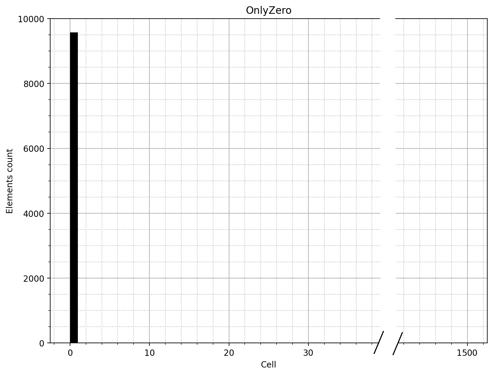

# Анализ производительности и оптимизация хеш-таблицы с использованием x86_64 assembly

## Описание
В данной работе проводится исследование быстродействия хеш-таблицы и оптимизация некоторых ее составляющих для получения максимального выигрыша в скорости. Конечной целью является получение информации об "узких местах" системы и способах преодоления этих ограничений с использованием минимально возможного количества платформозависимого кода.

## Установка и сборка
Рекомендуемым способом установки является клонирование репозитория [github](https://github.com/Iprime111/HashTableBenchmark) и сборка при помощи утилиты [cmake](https://cmake.org/). В примере ниже для компиляции используется система сборки [ninja](https://ninja-build.org/) и компилятор [gcc 13.2](https://gcc.gnu.org/).

```bash
> git clone git@github.com:Iprime111/HashTableBenchmark.git
> cd HashTableBenchmark
> git submodule update --init --remote --recursive
> mkdir build && cd build
> cmake .. -DCMAKE_BUILD_TYPE=Optimizations -DPGO_GENERATE=0 -DPGO_USE=0 -GNinja
> ninja
> ./bin/HashTableBenchmark
```

> [!IMPORTANT]
> Данная программа предназначена для сборки и запуска на устройствах с POSIX-совместимыми операционными системами, работающими на процессорах с архитектурой intel x86_64 tigerlake (тесты проводились на процессоре intel i7-1165g7 и arch linux)

## Хеш-таблица
### Принцип работы

Для ускорения доступа к данным (по сравнению с линейным поиском) зачастую применяется структура данных, исследуемая в этой работе. Основным принципом работы является вычисления хеша каждого добавленного элемента и использование полученного значения для адресации по массиву с данными. В результате, при использовании правильных алгоритмов хеширования и размера таблицы, можно добиться доступа к данным и их записи за константное время. Ниже приведена упрощенная схема работы хеш таблицы:

\
[*Источник*](https://alextoolsblog.blogspot.com/2019/12/hash-map.html)

### Разрешение коллизий
При работе с хеш-таблицей может возникнуть ситуация, называемая коллизией, когда хеши двух добавленных объектов оказываются одинаковыми. Причиной этого является ограниченность диапазона значений хеш-функции и размера таблицы. Существует множество способов разрешения коллизий (т.е. определения адресов в памяти для объектов с одинаковыми хешами). В исследуемой библиотеке используется следующий: в каждой ячейке таблицы располагается двусвязный список значений. При каждом доступе к ячейке производится линейный поиск по списку, что позволяет находить значения даже при коллизии. Может показаться, что такой метод увеличивает алгоритмическую сложность нахождения/добавления элемента до линейной, однако, при равномерном распределении значений хеша и достаточном размере таблицы, количество элементов в каждом из списков пренебрежимо мало и время доступа может считаться константным.

\
*[Источник](https://neerc.ifmo.ru/wiki/index.php?title=%D0%A0%D0%B0%D0%B7%D1%80%D0%B5%D1%88%D0%B5%D0%BD%D0%B8%D0%B5_%D0%BA%D0%BE%D0%BB%D0%BB%D0%B8%D0%B7%D0%B8%D0%B9)*

На рисунке выше, коллизия показана линиями красного цвета, ведущими к одной ячейке.

### Коэффициент заполнения
Одной из величин, характеризующих состояние хеш-таблицы, является **коэффициент заполнения** (англ. load factor), рассчитывающийся, как частное количества элементов в таблице и количества ячеек. От него напрямую зависит скорость поиска элемента, однако не стоит забывать, что **load factor отражает лишь среднее значение заселенности таблицы**, не показвая при этом равномерность распределения элементов по ячейкам. Таким образом, в ситуациях, когда в первой ячейке таблицы размером `100` ячеек находится `200` элементов и, когда эти `200` элементов равномерно распределены по всем ячейкам, коэффициент заполнения будет одинаков и равен `2`. При этом скорость работы структуры данных будет разительно отличаться. Этот пример показывает недопустимость оценки быстродействия хеш-таблицы по одному лишь параметру load factor, что в дальнейшем будет еще неоднократно продеионстрировано.

> [!NOTE]
> В работе используется специально написанная реализация хеш-таблицы, доступная в отдельном [репозитории](https://github.com/Iprime111/HashTable) на github

## Анализ хеш-функций 
В первой части данной работы исследовано поведения различных хеш-функций при использовании в хеш-таблице.

### Параметры тестирования
В тестах использовалась хеш-таблица, хранящая принимающая структуры, каждая из которых состоит из строки и ее длины. В качесте датасета был взят текст книги "Преступление и наказание", предварительно очищеный от всех знаков препинания (кроме апострофов) и приведенный к нижнему регистру (9576 уникальных слов). Размер таблицы (`1499` ячеек) был подобран так, чтобы load factor составлял `~6-7` элементов на ячейку. Число `1499` выбрано т.к. оно простое, а значит рамер таблицы гарантировано не будет кратен периоду хеш-функции, что позволяет избежать случаев, когда пики распределения значений хеша накладываются друг на друга.

### Методика измерений
В каждом из тестов хеш-таблица заполняется различными словами, а затем количество слов в каждой ячейке экспортируется, как csv файл, который в дальнейшем используется для построения гистограмм.

> [!NOTE]
> Для заполнения таблицы используются **только уникальные** слова (каждое встречается не более одного раза)

### Измерения
Ниже приведены измерения для 7 различных хеш-функций:

#### Всегда 0

- **Описание:**  Всегда возвращает 0
- **Дисперсия:** `61133.2`
- **Код:**
```c++
inline uint32_t OnlyZeroHash (WordData *word) {
    return 0;
}

```
- **Распределение:**



#### Первая буква

- **Описание:**  Возвращает ascii-код первой буквы
- **Дисперсия:** `3662.8`
- **Код:** 
```c++
inline uint32_t FirstLetterHash (WordData *word) {
    return (uint32_t) word->word [0];
}

```
- **Распределение:**


#### Длина слова

- **Описание:**  Возвращает длину слова
- **Дисперсия:** `7150.8`
- **Код:**
```c++
inline uint32_t WordLengthHash (WordData *word) {
    return (uint32_t) word->length;
}
```
- **Распределение:**


#### Нормализованная контрольная сумма

- **Описание:**  Возвращает сумму ascii-кодов букв слова, деленную на длину слова
- **Дисперсия:** `6328.9`
- **Код:**
```c++
inline uint32_t NormalizedChecksumHash (WordData *word) {
    uint32_t checksum = 0;

    for (size_t letterIndex = 0; letterIndex < word->length; letterIndex++) {
        checksum += (uint32_t) word->word [letterIndex];
    }

    return checksum / (uint32_t) word->length;
}
```
- **Распределение:**


#### Контрольная сумма (при малом размере таблицы)

- **Описание:**  Возвращает сумму ascii-кодов букв слова
- **Дисперсия:** `1512.5`
- **Код:**
```c++
inline uint32_t ChecksumHash (WordData *word) {
    uint32_t checksum = 0;

    for (size_t letterIndex = 0; letterIndex < word->length; letterIndex++) {
        checksum += (uint32_t) word->word [letterIndex];
    }

    return checksum;
}
```
- **Распределение:**


#### Контрольная сумма (при стандартном размере таблицы)
- **Описание:**  Повторяет предыдущий пункт
- **Дисперсия:** `78.7`
- **Код:** Повторяет предыдущий пункт

- **Распределение:**


#### Циклический сдвиг вправо
- **Описание:**  реализует алгоритм циклического сдвига вправо (ror hash)
- **Дисперсия:** `70.8`
- **Код:**
```c++
inline uint32_t RorHash (WordData *word) {
    uint32_t hash = 0;

    for (size_t charIndex = 0; charIndex < word->length; charIndex++) {
        hash = ((hash >> 1) | (hash << (sizeof (hash) * 8 - 1) )) ^ ((uint32_t) word->word [charIndex]);
    }

    return hash;
}
```
- **Распределение:**


#### Циклический избыточный код
- **Описание:**  реализует алгоритм crc32
- **Дисперсия:** `6.3`
- **Код:**
```c++
inline uint32_t Crc32Hash (WordData *word) {
    uint32_t hash = 0xFFFFFFFF;
    uint32_t mask = 0;

    for (size_t byteIndex = 0; byteIndex < word->length; byteIndex++) {

        uint32_t byte = (uint32_t) word->word [byteIndex];
        hash = hash ^ byte;

        for (int bitIndex = 7; bitIndex >= 0; bitIndex--) {
            mask = -(hash & 1);
            hash = (hash >> 1) ^ (0xEDB88320 & mask);
        }
    }

    return ~hash; 
}
```
- **Распределение:**


### Наложение периодов
Наряду с остальными хеш-функциями, в сравнении участвовала функция контрольной суммы (явно имеющая периодический характер). При этом были посторены гистограммы для двух размеров таблиц (`100` и `1499`). Отчетливо видно, что при размере `101` пики распределения накладываются друг на друга, увеличивая значение дисперсии с `78.7` до `1512.5`. Таким образом, можно сделать вывод, что выбор размера таблицы играет важную роль в равномерности распределения и, как следствие, оказывает влияние на скорость доступа к данным.

### Наиболее эффективная хеш-функция
Как можно заметить, при `load factor ~ 7`, наилучшее значение дисперсии (`6.3`), а значит и более равномерное распределение, показывает функция crc32. При этом наиболее близкие значения (у ror и контрольной суммы) на порядок больше и составляют `70.8` и `78.7` соответственно.

## Оптимизации хеш-таблицы
Во второй части данной работы исследуются возможности оптимизации работы хеш-таблицы. При этом предполагается, что характерным вариантом использования структуры данных является поиск значения. Часть оптимизаций, предложенных в данном пункте, имеет платформозависимый характер и требует поддержки `avx512` инструкций. Так как данная работа является учебной, одной из ее целей является реализация оптимизаций следующими способами:

1) Использование intrinsic функций
2) Использование ассемблерных вставок
3) Написание функции на ассемблере в отдельном файле

В качестве хеш-функции будет использоваться хеш crc32, показавший наилучшее значение дисперсии в предыдущем пункте. В данной серии тестов размер таблицы составляет `2048` элементов. Причины такого изменения будут объяснены ниже, однако уже на данном этапе работы можно утверждать, что увеличение размера таблицы до `2 ^ 11` не повлияет на равномерность распределения данных, так как хеш-функция crc32 не имеет явно выраженного периода, а значит наложения пиков распределения не произойдет.

### Критерии оценки
Как нетрудно заметить, платформозависимый код критически снижает переносимость программы и увеличивает сложность её понимания. В связи с этим, предлагается ввести некую метрику, позволяющую оценить выигрыш от использования непереносимого кода. В контексте данной работы такая величина будет именоваться коэффициентом деформации естественного диалекта (коэффициентом **ДЕДа**). Вычисляется это число по следующей формуле:

```
ДЕД = <прирост производительности> / <количество платформозависимых инструкций> * 1000
```

### Методика измерения

Измерениям подвергался цикл из `10^7` операций поиска в таблице. Каждое измерение проводилось 3 раза, а затем результаты усреднялись. Для нахождения необходимых значений использовался профилировщик [tracy](https://github.com/wolfpld/tracy). Выбор в его пользу был сделан из-за невысокого влияния на производительность (по данным официального репозитория на github) и возможности инструментирования кода, что позволяет включать в статистику только доступные для оптимизаций функции. При работе профилировщика генерируется графическое представление стека вызовов и статистика по времени выполнения каждой из запущенных функций. Запуск приложения производился от имени суперпользователя (root) для сбора большего количества данных сэмплинга.

### Платформонезависимые оптимизации

#### Написание эффективного кода

При написании библиотеки хеш-таблицы учитывался критерий быстродействия и возможность последующих оптимизаций, поэтому были реализованы следующие решения:

1) Легкая замена хеш-функции и компаратора с использованием шаблонов (позволяет избежать indirect call)
2) Возможность отключения верификаторов
3) Проверка инлайнинга наиболее часто вызываемых функций

Снятие данных до принятия вышеописанных изменений не имеет смыслы, так как включение верификаторов на порядок увеличивает время тестирования и не представляется возможным получить корректные результаты.

- **Время прохождения теста:** `4770 мс`

#### Использование компиляторных оптимизаций
Во многих современных компиляторах (gcc, clang, ...) широко используются не только оптимизации, работающие с промежуточным представлением кода (dead code elimination, loop unrolling и подобные), но и так называемые back end оптимизации, улучшающие эффективность программы на конкретной архитектуре процессора. В качестве примера подобного поведения можно привести изменение ассемблерного кода **ror hash**, используемого в первой части работы. Ниже повторно приведен код данной функции и его трансляция в ассемблер при флагах оптимизации `-O0` и `-O3`

```c++
inline uint32_t RorHash (WordData *word) {
    uint32_t hash = 0;

    for (size_t charIndex = 0; charIndex < word->length; charIndex++) {
        hash = ((hash >> 1) | (hash << (sizeof (hash) * 8 - 1) )) ^ ((uint32_t) word->word [charIndex]);
    }

    return hash;
}
```

**С флагом `-O0`:**                   |**С флагом `-O3`:**
--------------------------------------|----------------------------------------
|

Красным выделены части листинга, отвечающие непосредственно за рассчет хеша. Заметно, что количество инструкций сократилось. Такое возможно благодаря вставке инструкции `rorx`, производящей циклический сдвиг вправо. В языках C и С++ не существует соответствующей операции, однако за счет back end оптимизаций, включающихся при использовании флага `-O3`, возможно обнаружить несколько эквивалентных операций и заменить их на требуемую в процессе компиляции.\
\
Подобный принцип, наряду с остальными оптимизациями, используется во множестве других ситуаций и позволяет сильно ускорить выполнение программы. 

- **Время прохождения теста:** `2050 мс`
- **Ускорение относительно базовой версии:** `1.00`
- **Ускорение относительно предыдущей оптимизации:** `2.33`

Как видно из результатов теста, одно лишь добавление флага оптимизации `-O3` позволило ускорить работу программы более чем в 2 раза по сравнению с `-O0`. В дальнейшем, значение времени, полученное в данном тесте, будет использоваться в качестве baseline для сравнения.

### Платформозависимые оптимизации
Так как целью является минимизировать количество платформозависимого кода, необходимо точно определить места, в которых его применение даст максимальный прирост в скорости. Для решения этой задачи исследуем статистику, предоставляемую профилировщиком: 


По результатам тестирования видно, что большую часть всего времени поиска занимает операция нахождения хеша, а значит первоочередной целью оптимизации являются именно она. 

#### SIMD инструкции
Основным способом оптимизации, применяемым в данной работе, является использование **SIMD инструкций** (single instruction multiple data). Они позволяют проводить преобразования нескольких чисел сразу, ускоряя тем самым исполнение. Для хранения данных такие инструкции используют специальные векторные регистры длиной 128, 256 или 512 бит. Таким образом, возможно обрабатывать до 64 символов строки одновременно, используя 512-битовый `zmm` регистр. Код, исследуемый ниже, был написан для архитектур, поддерживающих `avx512` инструкции (набор инструкций с векторными регистрами длиной 512 бит).\
Так как все SIMD инструкции платформозависимы, в стандартных библиотеках языков C и C++ нет функций для их использования. Как решение этой проблемы, в больщинстве компиляторов доступны так называемые intrinsic функции, код которых не находится в отдельном файле, а подстанавливается непосредственно компилятором при сборке.

#### Оптимизация crc32
Для оптимизации хеш-функции было решено использовать intrinsic функции `_mm_crc32_u8()`, `_mm_crc32_u16()`, `_mm_crc32_u32()` и `_mm_crc32_u64()`. Они позволяют вычислить хеш crc32 при помощи соответствующей инструкции. При этом такой процесс занимает меньше времени, чем наивная реализация, так как вычисления происходят по аппаратно заданному алгоритму без затрат на декодирование ассемблерных инструкций в процессе. Также ускорению способствует то, что вышеуказанные функции позволяют обрабатывать несколько (до 4) символов за раз.\
Код реализации crc32 с использованием intrinsic функций:

```c++
#define IntHashLoop(INT_SIZE)                                                                                                                \
    do {                                                                                                                                    \
        for (; byteIndex <= (ssize_t) (word->length - sizeof (uint##INT_SIZE##_t)); byteIndex += (ssize_t) sizeof (uint##INT_SIZE##_t)) {   \
            hash = _mm_crc32_u##INT_SIZE (hash, *((uint##INT_SIZE##_t *) &word->word [byteIndex]));                                         \
        }                                                                                                                                   \
    } while (0)

inline uint32_t Crc32FastHash (WordData *word) {
    uint32_t hash     = 0xFFFFFFFF;
    ssize_t byteIndex = 0;

    IntHashLoop (64);
    IntHashLoop (32);
    IntHashLoop (16);
    IntHashLoop (8);

    return ~hash;
}
```

- **Время прохождения теста:** `1680 мс`
- **Ускорение относительно базовой версии:** `1.23`
- **Ускорение относительно предыдущей оптимизации:** `1.23`
- **Ускорение оптимизируемой функции:** `2.34`
- **Коэффициент ДЕДа:** `308`

#### Оптимизация функции сравнения строк
При дальнейшем исследовании программы в профилировщике возникает следующее распределение функций по времени:


Здесь видно, что на первом месте находится функция `FindElement ()`, однако, можно заметить, что в данном случае значительную часть времени исполнения занимает вызов профилировщика для дочерних функций, что подтверждается следующим снимком экрана:


В связи с этим фактом, предлагается провести оптимизицию следующей по списку функции компаратора строк.

Для поиска значения при коллизии хешей необходима функция, способная сравнить значения двух строк. В наивной реализации хеш-таблицы для этого используется `strcmp()` из стандартной библиотеки C. Действительно, для общего случая она вполне эффективна и её ускорение представляется сложной задачей. Однако, в данной работе рассматривается частный случай сравнения английских слов, длина которых не превышает 64 символа. Для решения этой задачи предлагается использовать SIMD инструкцию `vpcmpeqb`, позволяющую создать битовую маску равенства двух `zmm` регистров. Принцип ее работы заключается в побайтовом сравнении двух регистров и выставлении соответствующего бита маски в `1`, если байты равны. Таким образом, применяя операцию побитового отрицания к маске, на выходе мы получаем 64-битное число, равное нулю только если строки равны. Остается лишь учесть тот факт, что компаратор должен возвращать 32-битное число, уменьшив его размер путем применения побитового 'ИЛИ' между старшими и младшими разрядами.\
\
Код компаратора:

```c++
inline int WordsComparatorFast (HashTableLib::Pair <WordData, WordData> *firstWord, HashTableLib::Pair <WordData, WordData> *secondWord) {

    uint64_t mask = ~StreqFast (firstWord->key.word, secondWord->key.word);
    return (int) (mask | (mask << sizeof (int)));
}
```

Код функции сравнения:
```asm
.global _Z9StreqFastPcS_

.section .text

_Z9StreqFastPcS_:
    vmovdqu8 (%rdi), %zmm0
    vmovdqu8 (%rsi), %zmm1
    vpcmpeqb %zmm1, %zmm0, %k0
    kmovq %k0, %rax
    ret
```

- **Время прохождения теста:** `1510 мс`
- **Ускорение относительно базовой версии:** `1.36`
- **Ускорение относительно предыдущей оптимизации:** `1.11`
- **Ускорение оптимизируемой функции:** `2.34`
- **Коэффициент ДЕДа:** `170`


#### Link time и profile guided оптимизации
Как можно заметить, код, исполняющий инструкцию `vpcmpeqb`, был написан в отдельном файле. Такой подход не дает компилятору автоматически встроить код функции в вызывающую (как при использовании `inline`), что частично снижает эффективность подхода. Однако существуют решения, позволяющие обойти данную проблему. Таковыми являются `LTO` (link time optimization) и `PGO` (profile guided optimization).

##### LTO
Использование флага компиляции `-flto` позволяет компилятору gcc создавать файл дампа внутреннего представления кода, использующийся линкером для оптимизаций функций, находящихся в разных юнитах трансляции.

##### PGO
Метод profile guided optimization использует данные полученные при запуске программы для ее оптимизации при последующих компиляциях. Это позволяет производить множество оптимизаций, в числе котрых inlining функций и оптимизация ветвлений. Для генерации профиля используется флаг `-fprofile-generate`, а для использования `-fprofile-use`.\
\
Измерим итоговое время работы после использования вышеописанных оптимизаций:

- **Время прохождения теста:** `1420 мс`
- **Ускорение относительно базовой версии:** `1.44`
- **Ускорение относительно предыдущей оптимизации:** `1.06`
- **Коэффициент ДЕДа:** `180`

Как можно заметить, использование PGO и LTO дало прирост в скорости, поэтому в следующем тесте они также будут включены.

#### Оптимизация операции взятия модуля
Еще раз проведя анализ быстродействия функций, заметим, что самыми медленными неоптимизированными функциями являются линейный поиск значения в списке и получения номера списка по хешу. Так как не представляется возможным оптимизировать поиск без изменения принципа работы таблицы (напрмер добавления двойного хеширования для быстрого сравнения групп значений с эталонным при помощи SIMD интсрукций), было решено провести ускорение функции `GetList ()`, возвращающей номер нужного списка по значению.


Одной из операций, необходимой для нормального поиска элементов в таблице, является взятие остатка от деления значения хеша на размер таблицы. В наивном варианте это действие выполняется при помощи оператора `%`, доступного в языках C и C++. Такой метод позволяет обрабатывать любые размеры таблиц, однако плох излишними затратами времени (т.к. операция взятия остатка от деления выполняется за достаточно большое количество тактов). Решением этой проблемы является использование размера таблицы, равного степени двойки (что уже было сделано) и выполнение следующих операций:

```c++
listIndex = Hash & (hashTableSize - 1)
```

Для изменения поведения функции `GetList()` библиотеки хеш-таблицы было решено использовать специализацию шаблона, что позволет оставить код библиотеки в неизсенном состоянии. Так как данная задача является учебной и предполагает использование различных механизмов вставки ассемблерного кода в программу на C++, данное действие было выполнено при помощи ассемблерной вставки:

```c++
template <>
inline LinkedList::List <HashTableLib::Pair <WordData, WordData>, WordsComparatorFast> 
    *GetList (HashTableLib::HashTable <WordData, WordData, Crc32FastHash, WordsComparatorFast> *table, WordData *elementKey) {
    
    uint32_t listIndex = 0;
    asm (
        "and %2, %1\n"
        "movl %1, %0"
        : "=r" (listIndex)
        : "r" (Crc32FastHash (elementKey)), "r" ((uint32_t) HASH_TABLE_SIZE - 1)
    );

    return &table->table [listIndex];
}
```

- **Время прохождения теста:** `1390 мс`
- **Ускорение относительно базовой версии:** `1.47`
- **Ускорение относительно предыдущей оптимизации:** `1.11`
- **Ускорение оптимизируемой функции:** `2.34`
- **Коэффициент ДЕДа:** `147`

### Выводы
Как можно заметить, каждая из вышеописанных оптимизаций давала прирост в скрости, однако с каждым разом он уменьшался. Говоря о введенной нами метрике, стоит заметить, что самое высокое значение коэффициент ДЕДа имел после переписывания хеш-функции. Следующая за этим оптимизация компаратора внесла небольшой вклад. После анализа исходного кода stdlib gcc становится понятным, что библиотечный вариант функции `strcmp ()` уже имел в своем коде векторные инструкции, что позволило ему конкурировать с узкоспециализированной функцией сравнения. Операция взятия остатка от деления изначально вносила невысокий вклад в быстродействие системы, что и сказалось на низком приросте производительности после ее оптимизации. Из этого следует, что в коде, предназначенном для коммерческих целей, следует использовать только оптимизацию `crc32` (так как она имеет наибольшее значение ДЕДа) или не использовать платформозависимые оптимизации вовсе, ограничившись флагами компилятора `-O2` или `-O3` и `-flto`.
